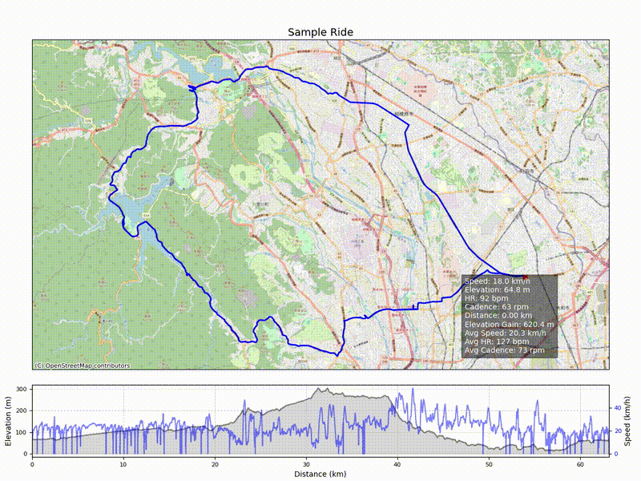

# ライドルートアニメーター

FITファイルからルート地図、標高グラフ、ライド統計を含む高解像度のアニメーション動画を生成します。  
カスタマイズ性、拡張性、美しいビジュアル表現を重視したツールです。

## 特長

- FITファイルからGPS、標高、速度、心拍数、ケイデンスを抽出  
- 背景タイル付きのルート地図を描画（OpenStreetMap、CartoDBなど）  
- 標高グラフと動的な統計オーバーレイを表示  
- 背景画像、動画タイトル、フレーム範囲・ステップ指定に対応  
- FFmpegを使ってMP4またはWebM形式で動画出力
- PillowWriterを使ってアニメーションGIFを出力

## サンプルアニメーション

## 必要環境

### Pythonパッケージ

以下のコマンドで必要なパッケージをインストールしてください：

    pip install fitparse matplotlib geopandas contextily pyproj shapely scipy pillow

※ `geopandas` や `pyproj` の使用には、`gdal`, `fiona`, `libspatialindex` などのシステムパッケージが必要な場合があります。

### FFmpeg

動画出力には FFmpeg が必要です。

- macOS: `brew install ffmpeg`  
- Ubuntu/Debian: `sudo apt install ffmpeg`  
- Windows: [ffmpeg.org](https://ffmpeg.org/download.html) からダウンロードし、PATHに追加してください

## 使い方

    python ride_route_animator.py -i activity.fit -o ride.mp4

### オプション一覧

| オプション                  | 説明 |
|----------------------------|------|
| `-i`, `--input`            | 入力FITファイル（必須） |
| `-o`, `--output`           | 出力動画ファイル（MP4またはWebM） |
| `--dpi`                    | 出力解像度（デフォルト: 150） |
| `--zoom`                   | タイルのズームレベル（デフォルト: 14） |
| `--fps`                    | フレームレート（デフォルト: 10） |
| `--tile`                   | 背景タイルプロバイダー（例: `OpenStreetMap.Mapnik`） |
| `--tilelist`               | 利用可能なタイル一覧を表示して終了 |
| `--title`                  | 動画に埋め込むタイトル |
| `--bg`                     | 背景画像のパス（任意） |
| `--no-elevation-smoothing`| 標高のスムージングを無効化 |
| `--overlay-style`          | 統計オーバーレイの位置（`top-left`, `top-right`, `bottom-left`, `bottom-right`） |
| `--start-frame`            | 開始フレーム番号（デフォルト: 0） |
| `--end-frame`              | 終了フレーム番号（デフォルト: 0 = 最後まで） |
| `--step-frame`             | フレームのステップ間隔（デフォルト: 1） |

### 使用例

    python ride_route_animator.py \
      -i activity.fit \
      -o ride.mp4 \
      --title "神奈川の朝ライド" \
      --tile CartoDB.DarkMatter \
      --bg background.png \
      --start-frame 100 \
      --end-frame 800 \
      --step-frame 5 \
      --overlay-style bottom-right

## 補足

- 一部のタイルプロバイダー（例: Strava）は認証が必要だったり外部アクセスを制限しています  
- WebM（VP9）形式はMP4（h264）よりもエンコードが遅くなる場合があります  
- フレーム範囲とステップを指定することで、部分的なアニメーションや高速再生が可能です

## 精度に関する注意

獲得標高や走行時間の計算は、Strava や Bryton Active などの商用プラットフォームと一致しない場合があります。  
これはスムージング処理、勾配フィルタ、デバイス固有のロジックの違いによるものです。

- 地形や記録間隔によって、獲得標高が過大または過小になることがあります  
- 走行時間は速度のしきい値に基づいて算出されており、Stravaの定義とは異なる可能性があります  
- これらの統計値はベストエフォートであり、今後改善される可能性があります

## GIF出力

このツールは MP4 や WebM に加えて、PillowWriter を使用したアニメーションGIFの出力にも対応しています。

GIFを生成するには以下のように実行します：

    python ride_route_animator.py -i activity.fit -o ride.gif

### GIFに関する注意点

- GIFのレンダリングは MP4 や WebM よりも遅くなります  
- 圧縮効率が低いため、ファイルサイズが大きくなる傾向があります  
- 色数が最大256色に制限されるため、画質が劣化する場合があります

### GIFの最適化方法

GIFのサイズを小さくし、描画速度を改善するには以下の方法が有効です：

- `--step-frame` を使ってフレームを間引く（例：`--step-frame 5`）  
- `--dpi` を下げて解像度を落とす（例：`--dpi 80`）  
- [gifsicle](https://www.lcdf.org/gifsicle/) を使って圧縮する：

      gifsicle -O3 ride.gif -o ride_optimized.gif

## ライセンス

MITライセンス（またはお好みのライセンスを指定してください）

## 作者

Created by atsushi  
フォーク・拡張・コントリビュート歓迎です！